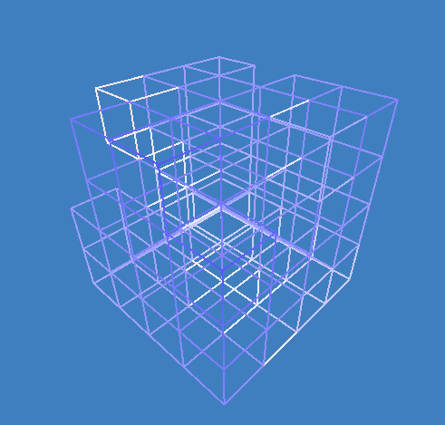
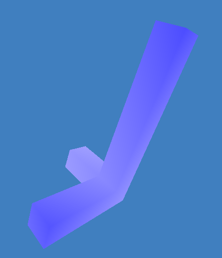

# 4D Visualizer

The fourth spatial dimension is inherently difficult to visualize. Leveraging the performance of Vulkan, we have implemented an application for users to explore the fourth dimension with full freedom of movement. The user has a properly-modeled field of view into the fourth dimension similar to the field of view one would normally get in the X, Y, and Z directions on a screen. The user can also collide with portions of the world to demonstrate itneresting properties of four-dimensional motion. We hope that this application helps the user feel embedded in a true four-dimensional world.

## Overview

||
|:-:|
|Observing some motion for an interesting 4D Grid.|

The implementation relies on compute shaders because vertex and fragment shaders do not readily support the math required to extend into extra dimensions. For this project’s framework we will be using [Anvil](https://github.com/GPUOpen-LibrariesAndSDKs/Anvil/), a wrapper for Vulkan in development by AMD. The application can generate and view voxel scenes made out of tesseracts.

In this visualization, the shades of red and blue are used to denote an object's distance across the w-direction. White means the object is "in front" of the user along this axis.

### Operation

Currently, this application is only expected to operate properly on Linux platforms. Important Windows paths are currently hardcoded and some functionality is not enabled on the platform.

To run the visualizer, supply the following mandatory arguments to the executable binary:
```
<Width> <Height> <Scene File | PERLIN | OPENSIMPLEX>
```

`<Width>` specifies the width of the visualizer window to launch.

`<Height>` specifies the width of the visualizer window to launch.

`<Scene File | PERLIN | OPENSIMPLEX>` specifies where to obtain mesh data for visualizing. This parameter can be the path to a file containing a series of individual tesseract coordinates listed in the space-delimited format "x y z w" with one set of coordinates per line. Example scenes are provided in the "scenes" folder. 

This parameter can also be provided as "PERLIN" or "OPENSIMPLEX" to have the visualizer generate its own coordinate data. If either of these options are chosen, the remaining arguments will alter additional parameters of the generation algorithm. If "PERLIN" is specified, our own four-dimensional Perlin implementation will be used to generate a contiguous piece of terrain. If "OPENSIMPLEX" is specified, Stephen Cameron's [open-simplex-noise-in-c](https://github.com/smcameron/open-simplex-noise-in-c) implementation is used to generate the terrain.

`[persistence]` is an optional parameter for the "PERLIN" setting which specifies the [persistence value](http://libnoise.sourceforge.net/tutorials/tutorial4.html) for shaping the terrain. Under the "OPENSIMPLEX" scheme, this parameter is used to alter the seed used for generating terrain. Defaults to 0.5.

`[frequency]` is an optional parameter for the "PERLIN" setting which specifies the [frequency value](http://libnoise.sourceforge.net/tutorials/tutorial4.html) for shaping the terrain. Under the "OPENSIMPLEX" scheme, this parameter is used to alter the seed used for generating terrain. Defaults to 2.0.

`[x size]` is an optional parameter specifying the length along the x-direction of the generated piece of terrain. Defaults to 12.

`[y size]` is an optional parameter specifying the length along the y-direction of the generated piece of terrain. Defaults to 12.

`[z size]` is an optional parameter specifying the length along the z-direction of the generated piece of terrain. Defaults to 12.

`[w size]` is an optional parameter specifying the length along the w-direction of the generated piece of terrain. This is the "fourth" axis which we have added to space in this visualizer. Defaults to 12.

### Controls

Users can interact with the visualizer using the following control scheme:
- `w` moves the user forwards.
- `s` moves the user backwards.
- `a` moves the user left.
- `d` moves the user right.
- `r` moves the user up.
- `f` moves the user down.
- `1` rolls the user's view to the left.
- `3` rolls the user's view to the right.
- `q` moves the user ana, in the positive w-direction.
- `e` moves the user kata, in the negative w-direction.
- `p` pauses the application to return mouse control.
- `t` toggles between rendering solid and wireframe scenes.

## Features

This visualizer application includes the following features to make it a more interactive and useful exploration tool:

### Compute Shader

A Vulkan compute shader is used to generate the scene data given a buffer of coordinates. For every set of coordinates in the list provided to the compute shader, a GPU thread is used to generate a unit-[tesseract](https://en.wikipedia.org/wiki/Tesseract) centered about that set. The compute shader then reads the camera's view matrix information to appropriately transform the scene. Depending on the rendering mode, an output buffer is written which either contains the points needed to rasterize triangles or draw lines to display the [envelope](http://eusebeia.dyndns.org/4d/vis/07-proj-3) of the four-dimensional scene when projected into the three-dimensional view.

|||
|:-:|:-:|
|A solid-rendered scene.|A wire-rendered scene.|

### Translation and Rotation in Four Dimensions

We have implemented some rewritten matrix code for five by five transformation matrices in order to support moving and rotating the view in this new visualizer setup. This necessitated implementing [GLFW](http://www.glfw.org/) into the project.

### Procedural Generation

The application supports procedural generation of terrain generated according to the "PERLIN" and "OPENSIMPLEX" modes described above. In either case, the performance cost of generating the terrain is dwarfed massively by the time it potentially takes to bake the scene.

|||
|:-:|:-:|
|Tightly-clustered Perlin noise.|Stephen Cameron's open simplex.|

### Collisions

Our visualizer has implemented collision detection between the user and the meshes in a scene by modeling the camera as a small hypercube. When the user gets too close to a piece of the scene, they are moved to the nearest cell. This enables the user to smoothly "slide" across the surface of colliding meshes.

|||
|:-:|:-:|
|Colliding with terrain.|Phasing through a wall.|

Collisions with the additional axis allow for some strange behavior. In the wall example provided, the user can translate across the w-axis to open a hole in the middle of the scene's wall. What's really going on here is they are translating to a piece of almost-identical geometry occupying the same space as the original wall translating one unit across w. Once the user translates to this second piece of geometry, the hole is open to them.

### User-specified Scenes

The user can specify their own scenes for loading as detailed above. Example scenes are included in the "scenes" folder to demonstrate the format that should be used. Reading these scene files replaces the "PERLIN" or "OPENSIMPLEX" parameters for terrain generation.

||||
|:-:|:-:|:-:|
|The wall scene.|A large block.|Some axes.|

## Benchmarks

By far the slowest part of our visualizer is the baking compute manager baking process. This is an Anvil-added process where the buffer of mesh coordinates is processed by the compute shader. While generating the mesh coordinates is very fast, as the number of meshes increases it takes progressively longer to initialize the scene. The following benchmarks were taken on a Windows 10, i5-4590 @ 3.30GHz 8GB, GTX 970 4GB desktop computer.

<p align="center">
  
</p>

It is worth noting that this baking process only needs to happen once upon scene initialization. In all cases tested, performance was well above the monitor refresh rate and the visualizer was not impacted. The difference between lines and triangles is in line with the amount of data that must be produced: a solid mesh must generate 144 output data points whereas a wireframe mesh generates only 64. Improving the performance of this baking process might be possible by implementing some sort of chunking mechanism to combine neighboring meshes into larger triangles. However, this is difficult to conceptualize in all dimensions so we stuck with the approach of constructing larger meshes out of discrete tesseracts.

## Conclusions

In conclusion, we believe that this visualizer allows for some very interesting exploration of four-dimensional geometry. Certain quirks are definitely unintuitive at first, such as the way that some objects disappear as you move closer to them. However, these can all be rationalized by understanding that sometimes moving towards an object like this causes it to drift out of your fourth-dimensional periphery. It's insights like these that we set out to model, and we consider this project to be a success. It was also an excellent excercise in working with Anvil and Vulkan.

|||
|:-:|:-:|
|"Orbiting" around the fourth axis.|Another example of orbiting.|

## Libraries and Supporting Code

This visualizer application would not have been possible without support from the following:
- [Anvil](https://github.com/GPUOpen-LibrariesAndSDKs/Anvil/), AMD's Vulkan wrapper.
- [open-simplex-noise-in-c](https://github.com/smcameron/open-simplex-noise-in-c), Stephen Cameron's C implementation of Kurt Spencer's Java implementation of open simplex, a free alternative to the simplex noise algorithm.
- [GLFW](http://www.glfw.org/), a keyboard-input library to enhance Anvil's input offerings.

## References:

We also found the following resources useful in understanding the fourth spatial dimension and how to implement this application:
- [4-polytope](https://en.wikipedia.org/wiki/4-polytope), for an overview of four-dimensional shapes.
- [libnoise](http://libnoise.sourceforge.net/tutorials/tutorial4.html), for a description of Perlin noise parameters.
- [eusebeia](http://eusebeia.dyndns.org/4d/), an entire site dedicated to explore the fourth Euclidean dimension.
